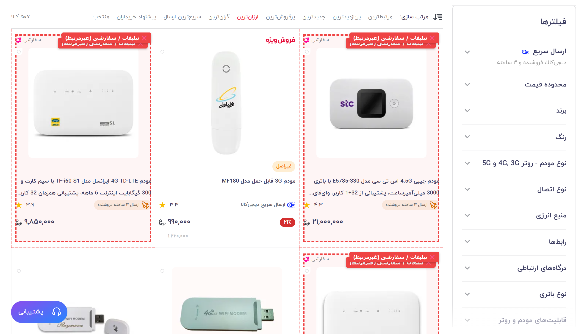
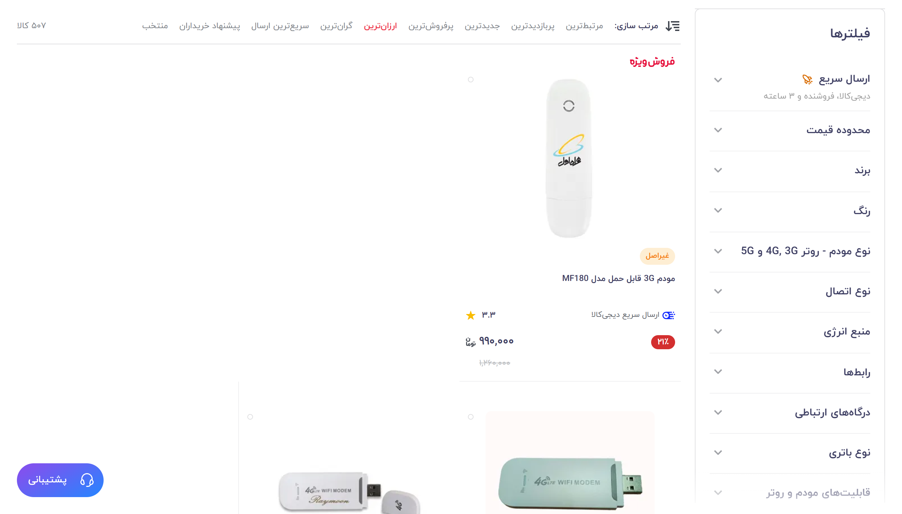

# 🛒 دیجی‌کالا سرچ ارگانیک و خالص (Digikala Pure Search)

**حذف هوشمند و قطعی تمام تبلیغات، کالاهای اسپانسر و نشان‌های «سفارشی» از دیجی‌کالا**  
*نمایش رتبه‌بندی و ترتیب ۱۰۰٪ واقعی محصولات در فیلترهای پرفروش‌ترین، ارزان‌ترین، محبوب‌ترین و تمامی جستجوها*

[نصب با تمپرمانکی](#-روش-اول-نصب-سریع-با-تمپرمانکی-پیشنهادی) • [نصب به عنوان افزونه کروم](#-روش-دوم-نصب-مستقیم-افزونه-روی-مرورگر) • [قوانین uBlock Origin](#-روش-سوم-استفاده-در-ublock-origin) • [ویژگی‌ها](#-قابلیت‌های-کلیدی)

---

## 🎯 مشکل چیست و این ابزار چه می‌کند؟

در وب‌سایت دیجی‌کالا هنگامی که کالایی را جستجو می‌کنید یا مرتب‌سازی را روی **«پرفروش‌ترین»**، **«ارزان‌ترین»** یا **«جدیدترین»** قرار می‌دهید، فروشندگان با پرداخت هزینه تبلیغات (سیستم Digikala Ads)، محصولات خود را با برچسب‌های کم‌رنگی مانند **«سفارشی»** یا **«آگهی»** در بالاترین رتبه‌های لیست تزریق می‌کنند.

این محصولات **واقعاً پرفروش یا ارزان نیستند** و قرار گرفتن آن‌ها در صدر نتایج باعث خطای دید و گمراهی خریدار می‌شود.

این ابزار با **پالایش هوشمند در سطح شبکه و DOM**، این کالاهای پولی و بنرهای نامرتبط را به طور کامل حذف می‌کند تا **فقط و فقط ترتیب واقعی فروش و محصولات ارگانیک** به شما نمایش داده شود.

---

## 📸 مقایسه قبل و بعد (Before / After)

### قبل از فعال‌سازی (محصولات تبلیغاتی و نامرتبط در صدر لیست):

### بعد از فعال‌سازی (لیست کاملاً پاک، ارگانیک و بر اساس فروش واقعی):

---

## ✨ قابلیت‌های کلیدی

- ⚡ **سازگار با همهٔ فیلترها و مرتب‌سازی‌ها:** عملکرد بی‌نقص روی پرفروش‌ترین، ارزان‌ترین، جدیدترین، پربازدیدترین و پیشنهاد خریداران.
- 🔍 **پشتیبانی از تمام جستجوها و دسته‌بندی‌ها:** پوشش سراسری روی تمامی صفحات دیجی‌کالا بدون استثنا.
- 🛡️ **عدم حذف تخفیف‌های واقعی:** کالاهایی که واقعاً پرفروش هستند و تخفیف یا فروش ویژه خورده‌اند حفظ می‌شوند و فقط تبلیغات پولی حذف می‌گردند.
- 🚀 **فوق‌العاده سریع و بدون پرش تصویر (Zero-Flicker):** مسدودسازی در سطح شبکه (Fetch Interceptor) قبل از رندر شدن در مرورگر.
- 📱 **سازگار با اسکرول نامحدود (Infinite Scroll):** هنگام لود شدن خودکار صفحات بعدی نیز تمام کالاها بلافاصله فیلتر می‌شوند.

---

## 🚀 روش‌های نصب و استفاده

شما می‌توانید به دلخواه خود از یکی از ۳ روش زیر استفاده کنید:

### 🔹 روش اول: نصب با تمپرمانکی (پیشنهادی و راحت‌ترین)

1. افزونه رایگان [Tampermonkey](https://www.tampermonkey.net/) (یا Violentmonkey) را روی مرورگر خود نصب کنید.
2. روی لینک زیر کلیک کنید تا اسکریپت باز شود:
   👉 **[دانلود و نصب اسکریپت (digikala-pure-search.user.js)](digikala-pure-search.user.js)**
3. دکمه **Install** را در پنجره باز شده بزنید. تمام!

---

### 🔹 روش دوم: نصب مستقیم افزونه روی مرورگر (Chrome / Edge / Brave)

اگر نمی‌خواهید از تمپرمانکی استفاده کنید، می‌توانید از پوشه `extension` داخل این ریپوزیتوری استفاده نمایید:

1. این ریپوزیتوری را به صورت فایل ZIP دانلود و استخراج (Extract) کنید.
2. در مرورگر خود به آدرس `chrome://extensions` بروید.
3. در گوشه بالا سمت راست، گزینه **Developer mode** را روشن کنید.
4. روی دکمه **Load unpacked** کلیک کرده و پوشه `extension` را انتخاب کنید.

---

### 🔹 روش سوم: استفاده در uBlock Origin یا AdGuard

اگر از افزونه معروف **uBlock Origin** استفاده می‌کنید:
1. وارد تنظیمات uBlock شده و به تب **My Filters** بروید.
2. کدهای داخل فایل **[ublock-filter.txt](ublock-filter.txt)** را کپی کرده و در انتهای لیست قرار دهید و دکمه **Apply changes** را بزنید.

---

## ❓ پرسش‌های متداول (FAQ)

<b>آیا با این کار محصولات دارای تخفیف یا شگفت‌انگیز حذف می‌شوند؟</b>

خیر! کالاهایی که واقعاً تخفیف خورده‌اند در جایگاه طبیعی خودشان باقی می‌مانند. فقط کالاهایی حذف می‌شوند که با پول و تبلیغات به صدر نتایج پرتاب شده‌اند.

<b>آیا این اسکریپت اطلاعات شخصی من را می‌خواند؟</b>

خیر، این اسکریپت کاملاً متن‌باز و سبک است و به هیچ سرور خارجی وصل نمی‌شود و دسترسی به اطلاعات حساب کاربری ندارد.

<b>اگر دیجی‌کالا ساختار سایت را عوض کند چه می‌شود؟</b>

این ابزار از ۳ لایه امنیتی (آدرس لینک `ad_variant_id` + آیکون‌های SVG + متن‌های نشانه + هوک شبکه) استفاده می‌کند تا در برابر تغییرات ظاهری سایت کاملاً مقاوم باشد.

---

## 🤝 مشارکت و ستاره دادن

اگر این ابزار به خرید بهتر و دقیق‌تر شما کمک کرد، خوشحال می‌شویم با دادن یک **Star ⭐️** در بالای صفحه از این پروژه حمایت کنید!

---

## 📜 لایسنس

این پروژه تحت لایسنس [MIT](LICENSE) منتشر شده است و استفاده از آن کاملاً آزاد و رایگان است.
